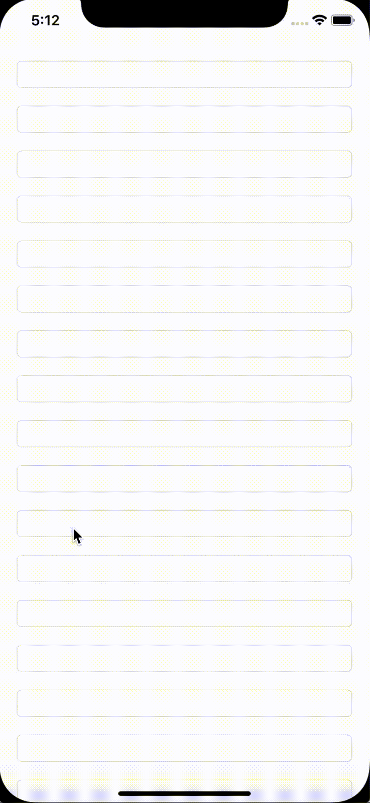
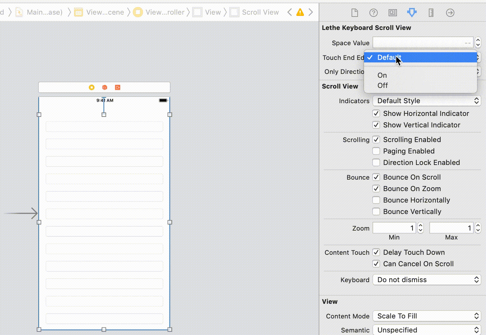

# LetheKeyboardScrollView

Installation
------------

### CocoaPods

Just add `pod 'LetheKeyboardScrollView'` to your Podfile then run `pod install` or `pod update`.

In any file you'd like to use LetheKeyboardScrollView in, don't forget to
import the framework with `import LetheKeyboardScrollView`.

### Manually
Download and drop LetheKeyboardScrollView.swift in your project.

Usage
---

you can configure

License
-------

LetheKeyboardScrollView is released under an MIT license. See ``LICENSE`` for more information.
