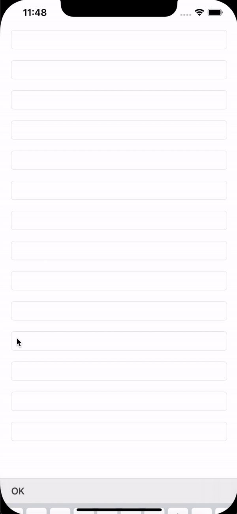

# OYKeyboardScrollView

Installation
------------

### CocoaPods

Just add `pod 'OYKeyboardScrollView'` to your Podfile then run `pod install` or `pod update`.

In any file you'd like to use OYKeyboardScrollView in, don't forget to
import the framework with `import OYKeyboardScrollView`.

### Manually
Download and drop OYKeyboardScrollView.swift in your project.

License
-------

OYKeyboardScrollView is released under an MIT license. See ``LICENSE`` for more information.
